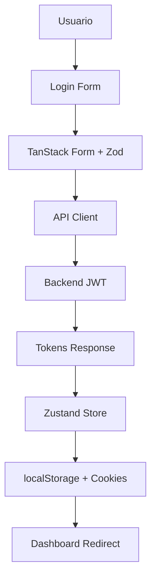

# Sistema de Autenticación Frontend

## 🔐 Arquitectura de Autenticación

### **Flow de Autenticación**


### **Componentes del Sistema**

#### **1. API Client con Interceptors**
```typescript
// /lib/api-client.ts
class ApiClient {
  private getAccessToken(): string | null {
    return localStorage.getItem('access_token');
  }

  private async refreshAccessToken(): Promise<string | null> {
    const refreshToken = localStorage.getItem('refresh_token');
    if (!refreshToken) return null;

    try {
      const response = await fetch('/api/auth/refresh', {
        method: 'POST',
        headers: { 'Content-Type': 'application/json' },
        body: JSON.stringify({ refresh_token: refreshToken }),
      });

      if (!response.ok) throw new Error('Token refresh failed');

      const data = await response.json();
      this.setTokens(data.access_token, data.refresh_token);
      return data.access_token;
    } catch (error) {
      this.clearTokens();
      window.location.href = '/login';
      return null;
    }
  }

  private async handleResponse<T>(response: Response): Promise<ApiResponse<T>> {
    if (response.ok) {
      return {
        data: await response.json(),
        status: response.status,
        headers: response.headers,
      };
    }

    // Auto-refresh en 401
    if (response.status === 401 && !response.url.includes('/auth/logout')) {
      const newToken = await this.refreshAccessToken();
      if (newToken) {
        // Retry request con nuevo token
        return this.retryRequest(response);
      }
    }

    throw new ApiError(response.status, await response.text());
  }
}
```

#### **2. Zustand Auth Store**
```typescript
// /store/auth.ts
interface AuthState {
  user: User | null;
  access_token: string | null;
  refresh_token: string | null;
  isAuthenticated: boolean;
  
  login: (tokens: Tokens, user: User) => void;
  logout: () => void;
  updateUser: (user: Partial<User>) => void;
  setTokens: (tokens: Tokens) => void;
}

export const useAuthStore = create<AuthState>()(
  persist(
    (set, get) => ({
      user: null,
      access_token: null,
      refresh_token: null,
      isAuthenticated: false,

      login: (tokens, user) => {
        set({
          user,
          access_token: tokens.access_token,
          refresh_token: tokens.refresh_token,
          isAuthenticated: true,
        });
        
        // Sync con localStorage
        localStorage.setItem('access_token', tokens.access_token);
        localStorage.setItem('refresh_token', tokens.refresh_token);
        
        // Sync con cookies para middleware
        document.cookie = `access_token=${tokens.access_token}; path=/; max-age=900`;
        document.cookie = `refresh_token=${tokens.refresh_token}; path=/; max-age=604800`;
      },

      logout: () => {
        set({
          user: null,
          access_token: null,
          refresh_token: null,
          isAuthenticated: false,
        });
        
        // Limpiar storage
        localStorage.removeItem('access_token');
        localStorage.removeItem('refresh_token');
        
        // Limpiar cookies
        document.cookie = 'access_token=; path=/; expires=Thu, 01 Jan 1970 00:00:01 GMT;';
        document.cookie = 'refresh_token=; path=/; expires=Thu, 01 Jan 1970 00:00:01 GMT;';
      },
    }),
    {
      name: 'auth-storage',
      partialize: (state) => ({
        user: state.user,
        access_token: state.access_token,
        refresh_token: state.refresh_token,
        isAuthenticated: state.isAuthenticated,
      }),
    }
  )
);
```

#### **3. Auth Hooks**
```typescript
// /hooks/useAuth.ts
export const useLogin = () => {
  const router = useRouter();
  const { login } = useAuthStore();
  
  return useMutation({
    mutationFn: async (credentials: LoginRequest) => {
      const response = await apiClient.post<LoginResponse>('/auth/login', credentials);
      return response.data;
    },
    onSuccess: (data) => {
      login(data.tokens, data.user);
      // Redirect manejado por useEffect en login page
    },
    onError: (error) => {
      console.error('Login failed:', error);
    },
  });
};

export const useLogout = () => {
  const router = useRouter();
  const queryClient = useQueryClient();
  const { logout } = useAuthStore();
  
  return useMutation({
    mutationFn: async () => {
      // Intenta logout backend, pero no bloquea si falla
      try {
        await apiClient.post('/auth/logout');
      } catch (error) {
        // Si es 401, el token ya expiró - proceder con logout
        if (error.status === 401) {
          console.log('Token already expired, proceeding with logout');
        } else {
          console.warn('Backend logout failed:', error);
        }
      }
    },
    onSuccess: () => {
      logout();
      queryClient.clear();
      router.push('/login');
    },
    onError: () => {
      // Siempre limpiar estado cliente incluso si backend falla
      logout();
      queryClient.clear();
      router.push('/login');
    },
  });
};
```

#### **4. Login Form con TanStack Form**
```typescript
// /components/forms/login-form.tsx
const loginSchema = z.object({
  email: z.string().email('Email inválido'),
  password: z.string().min(6, 'Mínimo 6 caracteres'),
});

export function LoginForm() {
  const loginMutation = useLogin();
  
  const form = useForm({
    defaultValues: {
      email: '',
      password: '',
    },
    onSubmit: async ({ value }) => {
      await loginMutation.mutateAsync(value);
    },
    validatorAdapter: zodValidator,
  });

  return (
    <Card>
      <CardHeader>
        <CardTitle>Iniciar Sesión</CardTitle>
      </CardHeader>
      <CardContent>
        <form onSubmit={(e) => {
          e.preventDefault();
          form.handleSubmit();
        }}>
          <form.Field
            name="email"
            validators={{
              onChange: loginSchema.shape.email,
            }}
            children={(field) => (
              <div>
                <Label htmlFor="email">Email</Label>
                <Input
                  id="email"
                  type="email"
                  value={field.state.value}
                  onChange={(e) => field.handleChange(e.target.value)}
                  placeholder="correo@ejemplo.com"
                />
                {field.state.meta.errors.map((error) => (
                  <p key={error} className="text-sm text-red-500">{error}</p>
                ))}
              </div>
            )}
          />
          
          <form.Field
            name="password"
            validators={{
              onChange: loginSchema.shape.password,
            }}
            children={(field) => (
              <div>
                <Label htmlFor="password">Contraseña</Label>
                <Input
                  id="password"
                  type="password"
                  value={field.state.value}
                  onChange={(e) => field.handleChange(e.target.value)}
                  placeholder="Tu contraseña"
                />
                {field.state.meta.errors.map((error) => (
                  <p key={error} className="text-sm text-red-500">{error}</p>
                ))}
              </div>
            )}
          />
          
          <Button 
            type="submit" 
            disabled={loginMutation.isPending}
            className="w-full"
          >
            {loginMutation.isPending ? 'Iniciando...' : 'Iniciar Sesión'}
          </Button>
        </form>
      </CardContent>
    </Card>
  );
}
```

#### **5. Protected Route Component**
```typescript
// /components/auth/protected-route.tsx
interface ProtectedRouteProps {
  children: React.ReactNode;
  requiredRole?: UserRole[];
  fallback?: React.ReactNode;
}

export function ProtectedRoute({ 
  children, 
  requiredRole, 
  fallback = <Loading /> 
}: ProtectedRouteProps) {
  const { isAuthenticated, user } = useAuthStore();
  const router = useRouter();

  useEffect(() => {
    if (!isAuthenticated) {
      router.push(`/login?redirect=${encodeURIComponent(window.location.pathname)}`);
      return;
    }

    if (requiredRole && !requiredRole.includes(user?.role || 'buyer')) {
      router.push('/unauthorized');
      return;
    }
  }, [isAuthenticated, user, requiredRole, router]);

  if (!isAuthenticated) {
    return fallback;
  }

  if (requiredRole && !requiredRole.includes(user?.role || 'buyer')) {
    return fallback;
  }

  return <>{children}</>;
}
```

#### **6. Role-based Access Control**
```typescript
// /hooks/useRoleCheck.ts
export const useRoleCheck = () => {
  const { user } = useAuthStore();
  
  const hasRole = (role: UserRole) => user?.role === role;
  
  const hasAnyRole = (roles: UserRole[]) => 
    roles.includes(user?.role || 'buyer');
  
  const hasMinimumRole = (minimumRole: UserRole) => {
    const roleHierarchy: UserRole[] = ['buyer', 'owner', 'agent', 'agency', 'admin'];
    const userRoleIndex = roleHierarchy.indexOf(user?.role || 'buyer');
    const minRoleIndex = roleHierarchy.indexOf(minimumRole);
    return userRoleIndex >= minRoleIndex;
  };
  
  return {
    hasRole,
    hasAnyRole,
    hasMinimumRole,
    isAdmin: hasRole('admin'),
    isAgency: hasRole('agency'),
    isAgent: hasRole('agent'),
    isOwner: hasRole('owner'),
    isBuyer: hasRole('buyer'),
    canCreateProperties: hasAnyRole(['admin', 'agency', 'agent', 'owner']),
    canManageUsers: hasAnyRole(['admin', 'agency']),
    canManageAgencies: hasRole('admin'),
    canViewStats: hasAnyRole(['admin', 'agency']),
  };
};
```

## 🔒 Seguridad

### **Token Management**
- **Access Token**: 15 minutos, almacenado en localStorage
- **Refresh Token**: 7 días, almacenado en localStorage + httpOnly cookie
- **Auto-refresh**: Interceptor automático en requests 401
- **Secure Storage**: Tokens también en cookies para middleware

### **CSRF Protection**
```typescript
// Headers de seguridad automáticos
const defaultHeaders = {
  'Content-Type': 'application/json',
  'X-Requested-With': 'XMLHttpRequest',
  'User-Agent': 'RealtyCore-Dashboard/1.0 (Next.js)',
};
```

### **XSS Prevention**
- **Input Sanitization**: Zod validation en todos los forms
- **Output Encoding**: React automático + DOMPurify si necesario
- **CSP Headers**: Configurados en next.config.js

### **Session Management**
```typescript
// Auto-logout en inactividad
export function useSessionTimeout() {
  const { logout } = useAuthStore();
  const TIMEOUT = 30 * 60 * 1000; // 30 minutos

  useEffect(() => {
    let timeout: NodeJS.Timeout;

    const resetTimeout = () => {
      clearTimeout(timeout);
      timeout = setTimeout(() => {
        logout();
      }, TIMEOUT);
    };

    // Reset en actividad del usuario
    const events = ['mousedown', 'mousemove', 'keypress', 'scroll', 'touchstart'];
    events.forEach(event => {
      document.addEventListener(event, resetTimeout, true);
    });

    resetTimeout();

    return () => {
      clearTimeout(timeout);
      events.forEach(event => {
        document.removeEventListener(event, resetTimeout, true);
      });
    };
  }, [logout]);
}
```

## 🔄 Error Handling

### **Auth Error Boundary**
```typescript
// /components/auth/auth-error-boundary.tsx
export class AuthErrorBoundary extends Component<Props, State> {
  public static getDerivedStateFromError(error: Error): State {
    if (error.name === 'AuthenticationError') {
      // Redirect to login
      window.location.href = '/login';
      return { hasError: true };
    }
    return { hasError: true };
  }

  public componentDidCatch(error: Error, errorInfo: ErrorInfo) {
    if (error.name === 'AuthenticationError') {
      // Log auth errors
      console.error('Authentication error:', error);
    }
  }
}
```

### **Network Error Handling**
```typescript
// /lib/error-handler.ts
export function handleApiError(error: ApiError) {
  switch (error.status) {
    case 401:
      // Handled by interceptor
      break;
    case 403:
      toast.error('No tienes permisos para esta acción');
      break;
    case 500:
      toast.error('Error del servidor. Inténtalo más tarde');
      break;
    default:
      toast.error('Error inesperado. Inténtalo más tarde');
  }
}
```

## 📱 Middleware de Autenticación

### **Next.js Middleware**
```typescript
// /middleware.ts
import { NextResponse } from 'next/server';
import type { NextRequest } from 'next/server';

export function middleware(request: NextRequest) {
  const token = request.cookies.get('access_token')?.value;
  
  // Rutas protegidas
  if (request.nextUrl.pathname.startsWith('/dashboard')) {
    if (!token) {
      return NextResponse.redirect(new URL('/login', request.url));
    }
  }
  
  // Redirect si ya está autenticado
  if (request.nextUrl.pathname === '/login' && token) {
    return NextResponse.redirect(new URL('/dashboard', request.url));
  }
  
  return NextResponse.next();
}

export const config = {
  matcher: ['/dashboard/:path*', '/login'],
};
```

## 🧪 Testing

### **Auth Hook Tests**
```typescript
// /hooks/__tests__/useAuth.test.ts
describe('useAuth', () => {
  test('login updates store state', async () => {
    const { result } = renderHook(() => useLogin());
    
    await act(async () => {
      await result.current.mutateAsync({
        email: 'test@example.com',
        password: 'password123',
      });
    });
    
    expect(useAuthStore.getState().isAuthenticated).toBe(true);
  });

  test('logout clears store and redirects', async () => {
    const { result } = renderHook(() => useLogout());
    
    await act(async () => {
      await result.current.mutateAsync();
    });
    
    expect(useAuthStore.getState().isAuthenticated).toBe(false);
  });
});
```

### **Form Tests**
```typescript
// /components/forms/__tests__/login-form.test.tsx
describe('LoginForm', () => {
  test('validates email format', async () => {
    render(<LoginForm />);
    
    const emailInput = screen.getByLabelText(/email/i);
    fireEvent.change(emailInput, { target: { value: 'invalid' } });
    
    await waitFor(() => {
      expect(screen.getByText(/email inválido/i)).toBeInTheDocument();
    });
  });

  test('submits form with valid data', async () => {
    const mockLogin = jest.fn();
    
    render(<LoginForm />);
    
    fireEvent.change(screen.getByLabelText(/email/i), {
      target: { value: 'test@example.com' }
    });
    fireEvent.change(screen.getByLabelText(/password/i), {
      target: { value: 'password123' }
    });
    
    fireEvent.click(screen.getByRole('button', { name: /iniciar sesión/i }));
    
    await waitFor(() => {
      expect(mockLogin).toHaveBeenCalledWith({
        email: 'test@example.com',
        password: 'password123',
      });
    });
  });
});
```

## 🚀 Mejores Prácticas

### **1. Security First**
- Nunca almacenar tokens en localStorage sin encriptación
- Siempre validar tokens en el servidor
- Implementar rate limiting en endpoints de auth
- Usar HTTPS en producción

### **2. UX Considerations**
- Loading states durante auth
- Error messages claros y útiles
- Auto-redirect después de login
- Remember me functionality

### **3. Performance**
- Lazy loading de rutas protegidas
- Optimizar store hydration
- Minimizar re-renders en auth state changes
- Cache user permissions

### **4. Monitoring**
- Log auth events
- Track failed login attempts
- Monitor token refresh rates
- Alert on security anomalies

---

Este sistema de autenticación proporciona una base sólida y segura para la aplicación, con manejo robusto de errores, UX optimizada y mejores prácticas de seguridad.